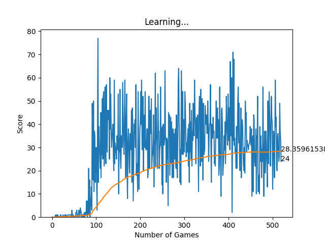

# Snake Game with Deep Q-Learning AI

## Overview

This project involves the development of a classic Snake game using Pygame, followed by the implementation of a Deep Q-Learning algorithm to create an AI model that can learn and excel at playing the game. The project demonstrates the use of reinforcement learning in a gaming environment, highlighting the process of training an AI agent to achieve high scores.

## Features

- **Classic Snake Game:** Built using the Pygame library.
- **Deep Q-Learning AI:** An AI agent that learns to play the game using a Deep Q-Learning algorithm.
- **Performance Metrics:** Includes plots for the number of games versus score and average score to visualize the learning progress of the AI.

## Project Structure
- snakegame.py: Contains the playable implementation of the Snake game using Pygame.
- model.py: Script to train the AI agent using the Deep Q-Learning algorithm.
- learning_graph.py: Script to generate performance plots.
- training_agent.py: Contains the Deep Q-Learning algorithm and the AI agent's logic.
- gameAI.py: Contains the implementation of the Snake game using Pygame for the AI model to play on.

## AI training...
- Training Step (train_step): Handles the training logic:
- Converts input data to PyTorch tensors.
- Handles batch inputs by ensuring the input tensors have the correct dimensions.
- Predicts Q-values for the current state.
- Updates Q-values based on the reward and the maximum Q-value of the next state.
- Computes the loss and backpropagates the error to update the network weights.

## Plot obtained after training for 500 games

